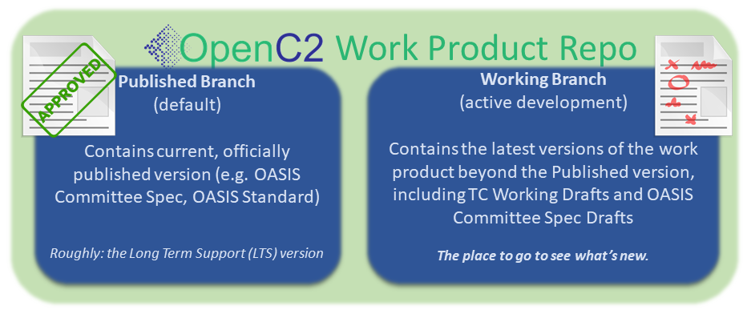

## README

##  An OASIS [Work Product](https://www.oasis-open.org/policies-guidelines/oasis-defined-terms-2018-05-22/#dWorkProduct) Repository  

Members of the OASIS [Open Command and Control (OpenC2) Technical
Committee](https://www.oasis-open.org/committees/tc_home.php?wg_abbrev=openc2)
use this GitHub repository as part of the [TC's chartered
work](https://www.oasis-open.org/committees/openc2/charter.php).
Contributors must be Members of the TC. Work is governed by the
OASIS policies and is not done under typical open source
licensing. For more details, see the
[Contributions](#writinghand-contributions-writinghand) and
[Licensing](#scroll-licensing-scroll) sections below. 

## :blue_book: _OpenC2 Actuator Profile Development Process_ :blue_book:

This repository supports developing a Committee Note describing the OpenC2's TC’s process for developing actuator profiles, including using the [JSON Abstract Data Notation (JADN)](https://docs.oasis-open.org/openc2/jadn/v1.0/cs01/jadn-v1.0-cs01.html) information modeling language to develop a rigorous AP schema.

### :twisted_rightwards_arrows: Repository Organization :twisted_rightwards_arrows:

OpenC2 work product repositories are organized a bit differently
than typical open source software project repositories:

* The **Published** (default) branch represents the current,
  stable, approved version of the work product. If the product
  hasn't progressed past an [OASIS Committee Specification Draft
  (CSD)](https://www.oasis-open.org/policies-guidelines/tc-process-2017-05-26/#committeeDraft),
  this branch is essentially empty.
* The **Working** branch is where all work-in-progress content is
  captured, and is the place to go for the [current working
  version]() of this work product.

> In the above bullet about the Working branch edit the `READMD.md` source to insert a link to the working version markdown file in the `working` branch of the repo.

More information about the TC's repository organizing conventions
and branching strategy can be found in our [Documentation
Norms](https://github.com/oasis-tcs/openc2-tc-ops/blob/main/Documentation-Norms.md#433-configure-repository).

### :left_speech_bubble: Description :left_speech_bubble:

OpenC2 [Actuator Profiles (APs)](https://docs.oasis-open.org/openc2/oc2arch/v1.0/cs01/oc2arch-v1.0-cs01.html#1-introduction) specify the subset of the OpenC2 language relevant in the context of specific actuator functions. A profile refines the meaning of language elements used to perform the actuator function, and often defines additional elements that are relevant and/or unique to that function. This Committee Note describes the TC’s process for using the [JSON Abstract Data Notation (JADN)](https://docs.oasis-open.org/openc2/jadn/v1.0/cs01/jadn-v1.0-cs01.html) information modeling language in the development of APs, resulting in a rigorous schema for an AP properly integrated with the base OpenC2 language.

### <a id="maintainers">Maintainers</a>

The maintainers for this repository are: 

- David Lemire - david.lemire@hii-tsd.com, GitHub: dlemire60, HII
- David Kemp - d.kemp@cyber.nsa.gov, GitHub: davaya, National Security Agency
- Mike Rosa - mjrosa@cyber.nsa.gov, GitHub: mjrosa, National Security Agency
- Duncan Sparrell - duncan@sfractal.com, GitHub: sparrell, sFractal Consulting

### :writing_hand: Contributions :writing_hand:

As stated in this repository's <a href="https://github.com/oasis-tcs/openc2-jadn/blob/master/CONTRIBUTING.md">CONTRIBUTING file</a>, contributors to this repository are expected to be Members of the OASIS OpenC2 TC, for any substantive change requests.  Anyone wishing to contribute to this GitHub project and <a href="https://www.oasis-open.org/join/participation-instructions">participate</a> in the TC's technical activity is invited to join as an OASIS TC Member.  Public feedback is also accepted, subject to the terms of the <a href="https://www.oasis-open.org/policies-guidelines/ipr#appendixa">OASIS Feedback License</a>.

### :scroll: Licensing :scroll:

Please see the <a href="https://github.com/oasis-tcs/openc2-jadn/blob/master/LICENSE.md">LICENSE</a> file for description of the license terms and OASIS policies applicable to the TC's work in this GitHub project. Content in this repository is intended to be part of the OpenC2 TC's permanent record of activity, visible and freely available for all to use, subject to applicable OASIS policies, as presented in the repository <a href="https://github.com/oasis-tcs/openc2-jadn/blob/master/LICENSE.md">LICENSE</a> file.

### :left_speech_bubble:   Further Description of this Repository :left_speech_bubble: 

This repository is designed to support TC members' work on a
formal specification that describes _identify work product_. This
GitHub repository supports development of the content and change
tracking for the _identify work product_ as new working draft
level revisions are created and the associated CSDs mature.

Members of the <a href="https://www.oasis-open.org/committees/openc2/">OASIS Open Command and Control (OpenC2) TC</a> create and manage technical content in this TC GitHub repository ( <a href="https://github.com/oasis-tcs/openc2-jadn">https://github.com/oasis-tcs/openc2-jadn</a> ) as part of the TC's chartered work (<i>i.e.</i>, the program of work and deliverables described in its <a href="https://www.oasis-open.org/committees/openc2/charter.php">charter</a>).

OASIS TC GitHub repositories, as described in <a href="https://www.oasis-open.org/resources/tcadmin/github-repositories-for-oasis-tc-members-chartered-work">GitHub Repositories for OASIS TC Members' Chartered Work</a>, are governed by the OASIS <a href="https://www.oasis-open.org/policies-guidelines/tc-process">TC Process</a>, <a href="https://www.oasis-open.org/policies-guidelines/ipr">IPR Policy</a>, and other policies, similar to TC Wikis, TC JIRA issues tracking instances, TC SVN/Subversion repositories, etc.  While they make use of public GitHub repositories, these TC GitHub repositories are distinct from <a href="https://www.oasis-open.org/resources/open-repositories">OASIS Open Repositories</a>, which are used for development of open source <a href="https://www.oasis-open.org/resources/open-repositories/licenses">licensed</a> content.

###  :envelope_with_arrow: Contact :envelope_with_arrow:

Please send questions or comments about <a href="https://www.oasis-open.org/resources/tcadmin/github-repositories-for-oasis-tc-members-chartered-work">OASIS TC GitHub repositories</a> to the <a href="mailto:tc-admin@oasis-open.org">OASIS TC Administrator</a>.  For questions about content in this repository, please contact the TC Chair or Co-Chairs as listed on the the <a href="https://www.oasis-open.org/committees/tc_home.php?wg_abbrev=openc2">OpenC2 TC's OASIS home page</a>.

